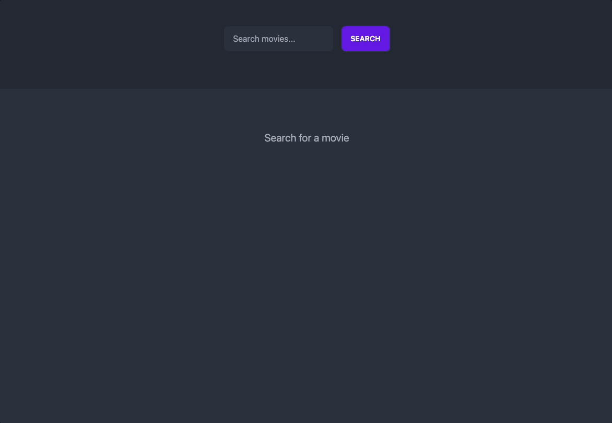

# Movie Search

A web application that searches for movies by title and displays up to 10 results on the page.

The web page calls a back-end web service, which calls The Movie Database (TMDB) API to find the search results. The back-end combines a few fields before returning the data to the web page, which displays the results in a simple, readable way.

## Running the project

To run the project, you will need to start both the front-end and back-end separately.

### Front-end

1. Navigate to the webapp folder.
2. Install the necessary dependencies by running npm install.
3. Start the front-end server by running `npm run dev`.
4. Open a web browser and go to <http://localhost:3000> to access the web page.

### Back-end

1. Navigate to the webservice folder.
2. Install the necessary dependencies by running npm install.
3. Start the back-end server by running `npm run dev`.
4. The back-end server will be running on <http://localhost:8000>.

## Technologies

**Front-end**: Vue.js with Nuxt

**Back-end**: Node.js with Express

## API specification

The back-end web service has a single endpoint that adheres to the following API spec:

Request:

```http
GET .../movies?search={title}
```

Response:

```json
[
  {
    "movie_id": integer,
    "title": string,
    "poster_image_url": string,
    "popularity_summary": string
  },
  ... (limit of 10)
]
```

## Recommendations for Future Versions

- Allow for pagination of search results
- Add the ability to filter results by different criteria (e.g. release year, genre)
- Add the ability to view more details about a selected movie (e.g. synopsis, cast)
- Integrate with additional movie APIs for a larger selection of results
- Add user authentication and the ability to save favorite movies

## Screenshot


